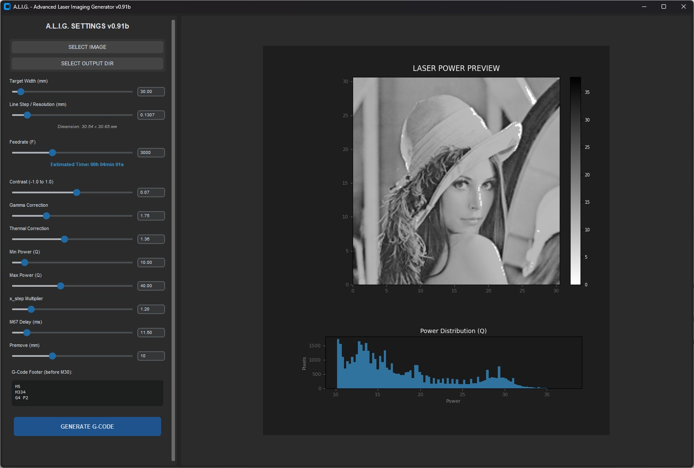
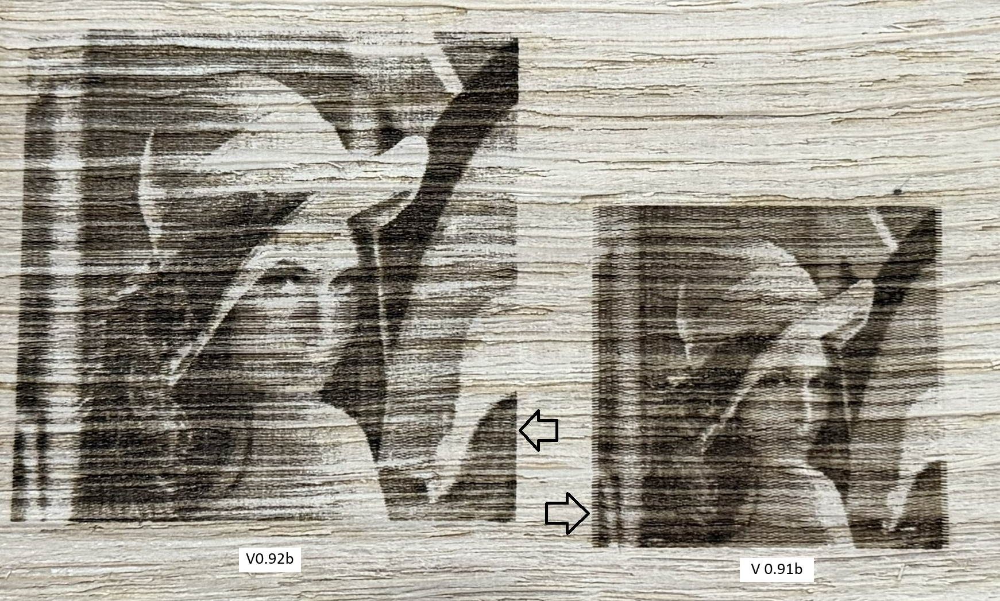

# A.L.I.G. - Advanced Laser Imaging Generator

## Description
A specialized G-Code generator for grayscale laser engraving using Mach4/PoKeys57CNC and M67 commands. This application is bundled with PyInstaller as a standalone executable, requiring no Python installation to run.

## Last version change (v0.92b)
Switched pre-moves from **G0 to G1** to ensure a constant velocity and eliminate the sawtooth effect on the image edges.

*Patterned vertical lines on X-axis. Likely mechanical vibration, PWM interference or image resolution conflict. If someone has the same artifacts, please let me know.*

## Parameters
### Line Step / Resolution (mm)
This is the "vertical resolution" of your project. It defines the distance between each horizontal pass of the laser.

* **Optimal Setting:** This value should ideally match your laser's physical beam spot size (typically between **0.1mm and 0.15mm** for most diodes).
* **The Focus Factor:** The ideal setting depends heavily on your **laser focus**. A perfectly focused laser allows for a finer step, while a slightly out-of-focus beam will require a larger step to cover the surface.
* **Too Low:** If the Line Step is too small, the laser passes will overlap excessively. This results in a **much darker image**, loss of detail, and potential over-charring of the wood fibers due to accumulated heat.
* **Too High:** If the Line Step is too large, you will see **visible gaps or white "striped" zones** between the passes where the material remains unmarked, leading to a faded and inconsistent result.

### Thermal Correction
The Thermal Correction setting adjusts the power ramp of your laser. By increasing this coefficient, you slow down the power rise, keeping the laser at lower intensities for a longer range of gray tones. This prevents premature wood carbonization and preserves subtle details in highlights and mid-tones, ensuring that high power is only reached for the deepest blacks.

### Min Power (Q)
Sets the power level for the lightest parts of your image. Since every material (wood types, MDF, etc.) has a different combustion threshold, this setting ensures the laser is already at its "starting point" for the first level of gray, preventing "dead zones" in the highlights.

### Max Power (Q)
Defines the upper power limit for the darkest pixels. Adjust this based on your laser's wattage and the material's density. The goal is to achieve a deep black without deep charring or structural damage to the wood fibers.

### X_step Multiplier
The X_step Multiplier reduces the resolution along the X-axis in order to reduce the controller workload and reach the desired feedrate. To maintain a feedrate of 3000mm/min, a value of **1.2** is sufficient for my setup.

### Delay Compensation
M67 commands and Laser drivers have internal delays. Therefore, there's a parameter to take this into account. In my build, at a feedrate of 3000mm/min, the ideal setting is **11.5 ms**. If this parameter is not correctly set, you will experience blur as the engraved lines will not align.

### Premove (Overscan)
Premove adds an overscan to allow your machine to reach a constant velocity before the laser starts engraving, ensuring consistent power delivery.

## Miscellaneous
* The last configuration used is automatically saved via `alig_config.json` in the same folder of the exe file.

---

## Support & Contributions
If you encounter any issues or have suggestions, feel free to open an **Issue**.

**Author:** Alexandre "MoMo"

---

## ⚠️ WARNING & SAFETY DISCLAIMER

> [!CAUTION]
> **LASER SAFETY:** This software generates G-Code utilizing `M3` and `M67` commands. **`M3` is used to arm the laser**, but on certain CNC configurations, it may trigger a spindle motor instead.
> 
> **HARDWARE COMPATIBILITY:** Always verify your G-Code and ensure your controller is explicitly set to **Laser Mode** before execution. Use this program at your own risk. The author assumes no liability for hardware damage or personal injury.

### Work Area & Premove Warning

> [!IMPORTANT]
> **OVERSCAN CALCULATION:** The "Premove" feature adds an **overscan distance** (default 15mm) to both sides of your image. 
> * **Example:** If your image is 100mm wide with a 15mm premove, the laser head will travel **130mm** in total.
> * **Action Required:** Ensure your machine's physical travel limits (Soft Limits/Hard Limits) can accommodate this extra width to avoid crashing into the frame. Always perform a "frame" or "boundary" check before firing.

### Operational Rules
* **Always wear certified laser safety goggles** matching your laser's wavelength.
* **Check your work surface:** Ensure the material is flat and that the extended travel path (including overscan) is clear of obstacles.
* **Never leave the machine unattended** while the laser is active.
* **Verify that your emergency stop is functional** before starting any job.

##  Infos, Tips & Tuning
This software is intended to be used on a CNC machine. I developped it as a desire to expand the capabilities of my Workbee/Queenbee based CNC. I used to work with **Auggie**, which is a functional solution, but I found it difficult to constantly switch **back and forth** between it and Mach4. I developed A.L.I.G. to provide a more streamlined workflow, allowing for direct integration and better control within the Mach4/PoKeys ecosystem.

* **Software version used:** MACH4 : build 6693 / Pokeys plugin : 9.17.0.5596
* **Software Settings (Mach4/PoKeys):** * In the PoKeys plugin settings (**Configure > Plugins > PoKeys > Miscellaneous**), ensure your PWM pin box is checked and set **Spindle Control** to "None".
    * In the Mach4 Analog Output settings:
        * Map **Analog Output 0** to your device name (**PoKeys_XXXXX**).
        * Select the correct **PWM Duty** (corresponding to your hardware PWM pin).
        * **Crucially:** Set both the **Numerator and Denominator to 1**, and leave the **Offset at 0**.

* **PWM Frequency:** Depending on your motion controller and laser driver, you should experiment to find the optimal PWM frequency. For instance, I originally used 20 kHz but struggled to achieve a full range of grayscale. Lowering the frequency to **5000 Hz** significantly improved the laser's response and the subtlety of the gradients.

* **Reference Point:** Currently, the origin (0,0) is fixed to the **lower-left corner** of the image.

* **Dedicated Mach4 Profile:** It is highly recommended to create a **separate profile** in Mach4 specifically for laser engraving. 
    * This prevents laser settings (like PWM mapping and Spindle-to-None configuration) from interfering with your standard milling/routing setups.
    * It allows you to fine-tune your motor acceleration and velocity for laser work without affecting your heavy-duty milling parameters.

